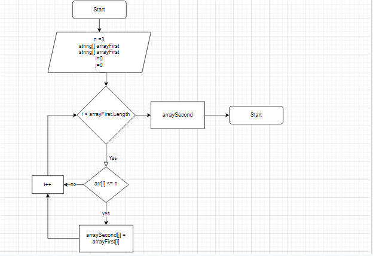

## Итоговая работа

## Задача
Написать программу, которая из имеющегося массива строк, длина которого меньше, либо равна 3 символа. Первоначальный массив можно ввести с клавиатуры, либо задать на старте выполнения алгоритма.

## Алгоритм решения
1. Создали строковый массив.
2. Создали метод заполняющий массив. Массив заполняется пользователм с клавиатуры (так же создали метод заолнения массива рандомными значениями).
3. Создали метод вывода заполненного массива на экран.
4. Создали метод определяющий длину нового массива.
5. Создали условие окончания программы, если размер массива равен нулю.
6. Создали метод, кторый переносит требуемые элементы из первого массива во второй.
7. Вывели на экран нужный массив.
8. Добавили блок-схему алгоритма решения задачи.
